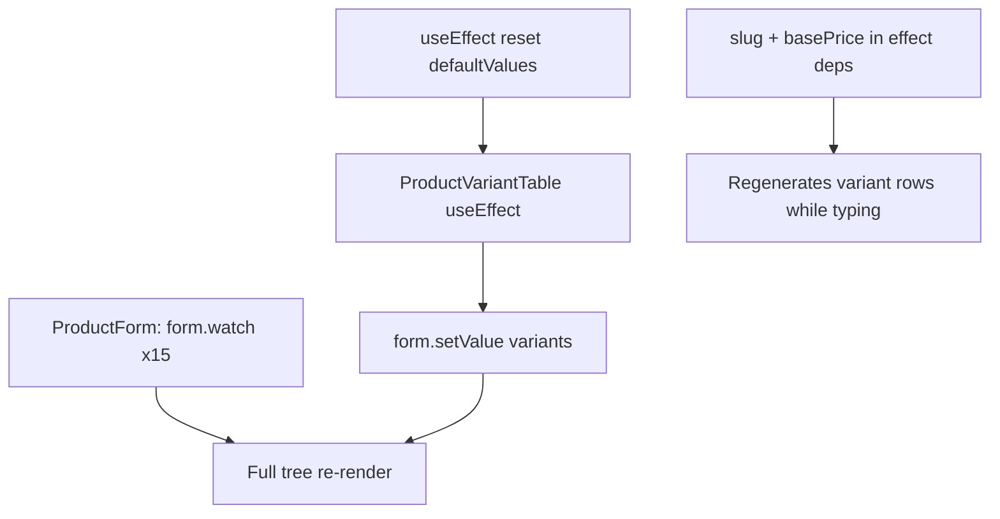

# Product Form: Reusable Without Over-Splitting + No Re-Render Loops

## Problem today

[`product-form.tsx`](../src/components/products/product-form.tsx) (~600 lines) is a single mega-component with **15+ `form.watch()` calls** at the root. Any field change re-renders the entire tree (sidebar, attribute picker, variant table, all selects).

Known loop / churn risks:



| Risk                | Location                                         | Issue                                                                                |
| ------------------- | ------------------------------------------------ | ------------------------------------------------------------------------------------ |
| Root-level watches  | `product-form.tsx`                               | Subscribes whole page to every keystroke                                             |
| Variant sync effect | `product-variant-table.tsx` L61–74               | `setValue('variants')` on `slug` / `basePrice` change rewrites rows while user types |
| Duplicate queries   | `product-form.tsx` + `product-variant-table.tsx` | Both call `useGetProductAttributesByIds` for same IDs                                |
| Edit hydration      | `product-form.tsx` reset effect                  | `form.reset(defaultValues)` whenever reference changes                               |

**Do not** split into dozens of field components (`ProductTitleField`, `ProductSlugField`, …). That adds files without fixing re-renders.

---

## Target architecture (minimal, purposeful split)

Keep existing leaf components — they are the right size:

- `product-attribute-picker.tsx`
- `product-variant-table.tsx`
- `product-media-sidebar.tsx`
- `picked-image-chips.tsx`

Add only **2 hooks + 2 section components + 1 tiny wrapper**:

```
components/products/
  product-form.tsx              # ~80 lines: shell, FormProvider, layout
  product-form-sidebar.tsx      # status, media, flags (uses useFormContext)
  product-form-main-fields.tsx  # identity, commerce, content, SEO
hooks/
  use-product-form.ts           # init, submit, slug rule, pickTarget state
  use-auto-variants.ts          # variant matrix sync with equality guard
lib/
  product-variant-sync.ts       # pure: buildMergedVariants + variantsEqual
```

**Total new surface:** 5 files. No further component extraction unless a section exceeds ~200 lines later.

---

## 1. FormProvider instead of prop-drilling `form`

Wrap the form once in `product-form.tsx`:

```tsx
<FormProvider {...form}>
  <form onSubmit={onSubmit}>...</form>
</FormProvider>
```

Child components use `useFormContext<CreateProductFormValues>()`.

---

## 2. Scope watches with `useWatch` (leaf-only)

**Rule:** Root `ProductForm` may watch **at most 2 fields** needed for cross-section logic.

Inside sections, replace inline `form.watch('status')` with:

```tsx
const status = useWatch({ name: "status" });
```

Or use `Controller` for Select/Switch fields so only that control re-renders.

---

## 3. Fix variant auto-generation (main loop fix)

Extract to `hooks/use-auto-variants.ts`:

**Stable dependency key:**

```typescript
const comboKey = selectedAttributes
  .map((a) => `${a.attributeId}:${[...a.optionIds].sort().join(",")}`)
  .sort()
  .join("|");
```

**Effect deps:** `[comboKey]` only — **remove `slug` and `basePrice`** from regen triggers.

- Existing rows: preserve via `mergeVariantsFromCombos`
- New rows: read slug/basePrice via `getValues()` inside effect, not as dep

**Equality guard before setValue:**

```typescript
if (!variantsEqual(current, merged)) {
  setValue("variants", merged, { shouldValidate: true });
}
```

---

## 4. Consolidate attribute label fetching

Remove duplicate `useGetProductAttributesByIds` from `product-form.tsx`.

Compute `variantLabels` inside `product-media-sidebar.tsx` (where consumed) or via one shared `useVariantOptionLabels` hook.

---

## 5. Safe edit hydration

Use a ref guard so reset runs once:

```typescript
const hydratedRef = useRef(false);
useEffect(() => {
  if (defaultValues && !hydratedRef.current) {
    reset(defaultValues);
    hydratedRef.current = true;
  }
}, [defaultValues, reset]);
```

---

## 6. Shared UI constants (not components)

`product-form.constants.ts`:

```typescript
export const productInputClassName = "...";
export const productSectionClassName = "...";
```

Optional single `ProductFormSection` wrapper — not one per section.

---

## 7. Cursor rule

Add `.cursor/rules/react-product-forms.mdc`:

- Prefer `FormProvider` + scoped `useWatch` over root-level `form.watch`
- Never put `form` in `useEffect` deps
- `setValue` in effects must compare before write
- Max ~200 lines per component; extract hook before UI
- Do not create one component per form field

---

## 8. Verification

- Type in title/slug — unrelated sections do not flicker
- Toggle attribute options — variants appear once, no effect spam
- Change slug on edit — existing variant SKUs stay stable
- Edit page loads once, no reset loop
- `npm run build` passes

---

## Files to touch

| Action   | File                                                                                     |
| -------- | ---------------------------------------------------------------------------------------- |
| Refactor | `product-form.tsx`                                                                       |
| New      | `product-form-sidebar.tsx`, `product-form-main-fields.tsx`, `product-form.constants.ts`  |
| New      | `hooks/use-product-form.ts`, `hooks/use-auto-variants.ts`, `lib/product-variant-sync.ts` |
| Fix      | `product-variant-table.tsx` — remove inline effect, call hook                            |
| New      | `.cursor/rules/react-product-forms.mdc`                                                  |

No backend changes.
